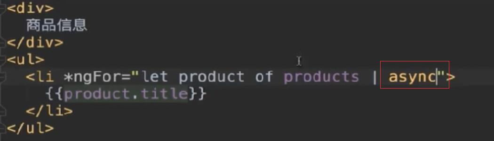

# 14-Angular 4.0从入门到实战 打造股票管理网站  全

# 第八章（web服务器auction配套server）

## 8-2 web服务器

*初始化server文件夹生成一个package.json文件*

**npm init -y
Wrote to D:\workspace\AG2\server\package.json: **

```json
{
  "name": "server",
  "version": "1.0.0",
  "description": "",
  "main": "index.js",
  "scripts": {
    "test": "echo \"Error: no test specified\" && exit 1"
  },
  "keywords": [],
  "author": "",
  "license": "ISC"
}
```

*引入node 的typescript文件*

**npm i @types/node --save**

*新加一个typescript.json文件*

```
{
  "compilerOptions": {
    "module": "commonjs",
    "target": "es5",
    "sourceMap": true ,

    "emitDecoratorMetadate": true,
    "experimentalDecorators": true,
    "outDir": "build",
    "lib": ["es6"]
  },
  "exclude": [
    "node_modules"
  ]
}
```

修改webstorm配置

 

hello_server.ts代码：

```json
import * as http from 'http'
const server = http.createServer((request,response)=>{
    response.end("Hello Node!");
});
server.listen(8000);

```

运行代码：

**D:\workspace\AG2\server>node build/hello_server.js**

页面返回 Hello Node!

***

**为了减少代码。。。 安装express框架**

> npm install express --save

> npm install @types/express --save

新建auction_server.ts

```js
import * as express from 'express'
const app = express();
app.get('/',(req,res)=>{
    res.send("Hello Express");
});
app.get('/',(req,res)=>{
    res.send("接收到商品查询请求！")
});

const server = app.listen(8000,"localhost",()=>{
    console.log("服务器已启动，地址是：http://localhost:8000");
})

```

启动服务器：

D:\workspace\AG2\server>node build/auction_server.js
服务器已启动，地址是：http://localhost:8000

***

**nodemon工具** 用于监控代码

npm install -g nodemon

运行服务改成： nodemon build/auction_server.js

***

修改auction_server.ts 配套代码：

```js
import * as express from 'express'
export class Product {
    constructor(
        public  id:number,
        public title:string,
        public price:number,
        public rating:number,
        public desc:string,
        public categories:Array<string>

    ){
    }
}
const products :Product[] = [
    new Product(1,"第一个商品",1.99,3.5,"这是第1个商品，是我在学习慕课网Angular入门实战时创建的",["电子产品","硬件设备"]),
    new Product(2,"第二个商品",2.99,2.5,"这是第2个商品，是我在学习慕课网Angular入门实战时创建的",["图书"]),
    new Product(3,"第三个商品",3.99,4.5,"这是第3个商品，是我在学习慕课网Angular入门实战时创建的",["硬件设备"]),
    new Product(4,"第四个商品",4.99,1.5,"这是第4个商品，是我在学习慕课网Angular入门实战时创建的",["电子产品","硬件设备"]),
    new Product(5,"第五个商品",5.99,3.5,"这是第5个商品，是我在学习慕课网Angular入门实战时创建的",["电子产品"]),
    new Product(6,"第六个商品",6.99,2.5,"这是第6个商品，是我在学习慕课网Angular入门实战时创建的",["图书"]),
    new Product(7,"第七个商品",4.99,3.5,"这是第7个商品，是我在学习慕课网Angular入门实战时创建的",["图书"])
];

const app = express();
app.get('/',(req,res)=>{
    res.send("Hello Express!!!");
});
app.get('/products',(req,res)=>{
    // res.send("接收到商品查询请求！");
    res.json(products);
});
app.get('/products/:id',(req,res)=>{
    res.json(products.find((product)=>product.id ==req.params.id ));
});
const server = app.listen(8000,"localhost",()=>{
    console.log("服务器已启动，地址是：http://localhost:8000");
})

```


***

## 8-3 http通讯

### 1. 手工subscribe 订阅流 

在客户端中 引入 import ’rxjs/Rx‘  ：


客户端侧配置代理文件 proxy.conf.json 

server文件中，修改请求路径，“/api/xxxxx”


### 2. 异步管道方式

客户端模板文件



客户端ts文件：


***

请求头的使用：

在上面文件中添加：


